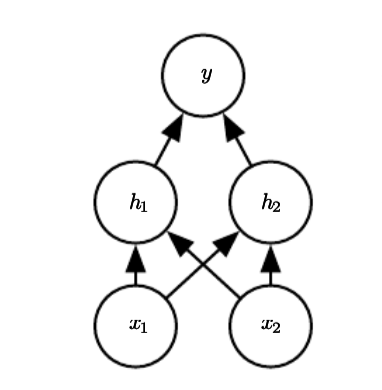

# XOR-MLP-from-Scratch

This project implements a simple **Multi-Layer Perceptron (MLP) from scratch** to learn the XOR function. The network is trained using **backpropagation and gradient descent**, without using libraries like TensorFlow or PyTorch. The implementation includes matrix operations, activation functions, and optimization without external dependencies.

## Problem Definition
The **XOR function** ("exclusive or") is a logical operation on two binary values, $x_1$ and $x_2$:

- When **exactly one** of these binary values is equal to 1, the XOR function returns 1.
- Otherwise, it returns 0.

Mathematically, we define the XOR function as:

$$
y = x_1 \oplus x_2
$$

where $y$ is the expected output.

The XOR function provides the target function $y = f^*(\mathbf{x})$ that we want to learn. Our neural network provides a function $y = f(\mathbf{x}; \theta)$, and our **learning algorithm** will optimize the parameters $\theta$ to make $f$ as close as possible to $f^*$.

## Training Data
The four possible XOR inputs and outputs:

| $x_1$ | $x_2$ | XOR Output $y$ |
|----|----|----|
| 0  | 0  | 0  |
| 0  | 1  | 1  |
| 1  | 0  | 1  |
| 1  | 1  | 0  |

We train our **MLP model** to correctly classify these four points.

## Network Architecture
The XOR problem is **not linearly separable**, meaning a simple perceptron cannot solve it. Instead, we use an **MLP with one hidden layer**:

- **Input Layer:** 2 neurons $(x_1, x_2)$
- **Hidden Layer:** 2 neurons with **ReLU activation**
- **Output Layer:** 1 neuron with **Sigmoid activation**

## Mathematical Formulation
### Forward Propagation
#### **Hidden Layer**
Compute the hidden layer pre-activation:

$$
Z_1 = X W_1 + b_1
$$

Apply the **ReLU activation**:

$$
A_1 = \max(0, Z_1)
$$

#### **Output Layer**
Compute the output layer pre-activation:

$$
Z_2 = A_1 W_2 + b_2
$$

Apply the **Sigmoid activation**:

$$
A_2 = \frac{1}{1 + e^{-Z_2}}
$$

This gives the final prediction $A_2$, which is compared to the true label.

### Binary Cross-Entropy Loss
We use **binary cross-entropy** loss for optimization:

$$
L = -\frac{1}{m} \sum_{i=1}^{m} \left[ y_i \log(A_{2,i}) + (1 - y_i) \log(1 - A_{2,i}) \right]
$$

where $m$ is the number of training samples.

### Backpropagation
We compute the gradients using the chain rule:

- $dA_2 = A_2 - Y$
- $dZ_2 = dA_2$
- $dW_2 = A_1^T dZ_2$
- $db_2 = \sum dZ_2$
- $dA_1 = dZ_2 W_2^T$
- $dZ_1 = dA_1 \cdot (Z_1 > 0)$ (ReLU derivative)
- $dW_1 = X^T dZ_1$
- $db_1 = \sum dZ_1$

Finally, we **update the weights** using gradient descent:

$$
W = W - \alpha \cdot dW, \quad b = b - \alpha \cdot db
$$

where $\eta$ is the learning rate.

## References
- Deep Learning (Ian Goodfellow, Yoshua Bengio, Aaron Courville)
